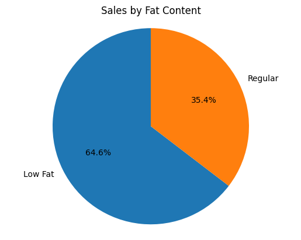
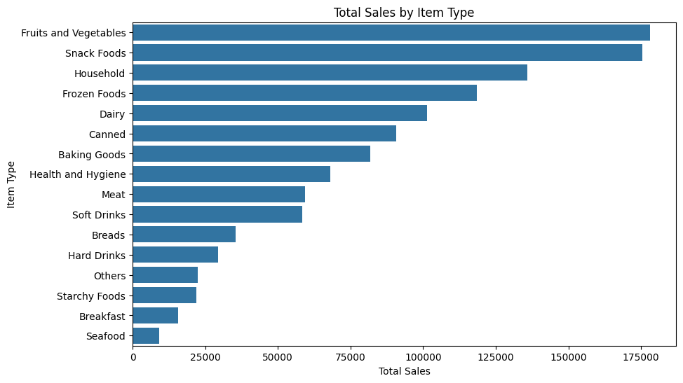
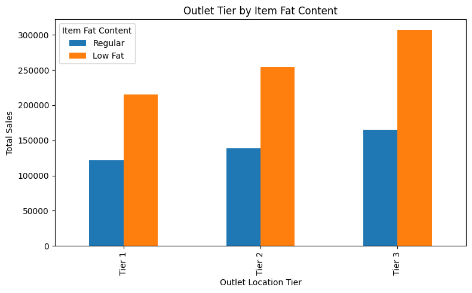
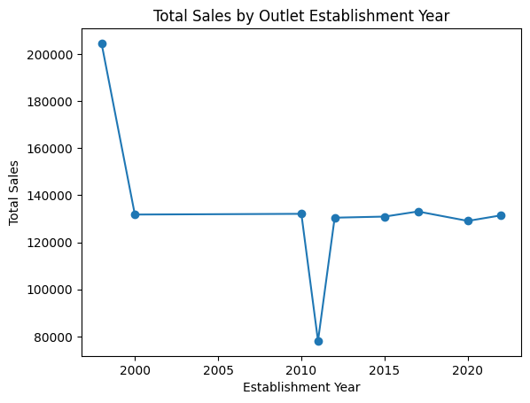
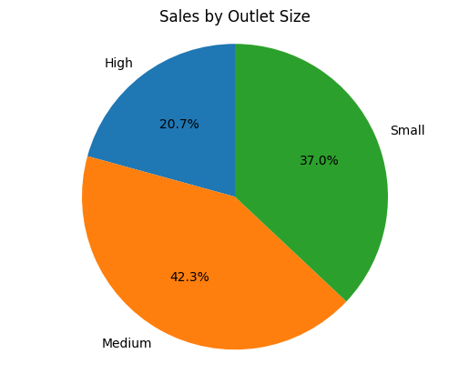
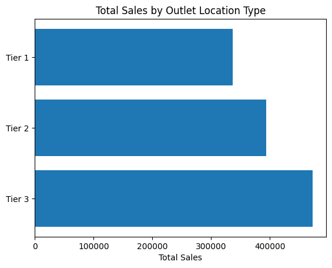

# Blinkit Sales Analysis

An end-to-end exploratory data analysis of Blinkit's item and outlet sales data, built in Python. This project was originally scoped as a Power BI dashboard assignment (KPI cards + 6 required charts) and rebuilt from the ground up in a Jupyter notebook using pandas, matplotlib, and seaborn — including the full data cleaning process that a raw retail dataset actually needs before any chart is trustworthy.

## Why this project

The original brief (see `Blinkit Analysis.pptx`) asked for: total sales, average sales, item count, and average rating as KPIs, plus 6 specific charts breaking sales down by fat content, item type, outlet, outlet age, outlet size, and outlet location. Rather than build this in Power BI, I rebuilt the entire pipeline in Python — data cleaning, KPI calculation, and every chart — as a way to demonstrate the same analysis using pandas/matplotlib instead of a drag-and-drop BI tool.

## Dataset

`blinkit_raw_data.csv` — 8,523 item-level sales records, one row per item sold at a given outlet.

| Column | Description |
|---|---|
| Item Fat Content | Low Fat / Regular (raw data had inconsistent labels — cleaned below) |
| Item Identifier | Unique item code |
| Item Type | Product category (Snacks, Dairy, Frozen Foods, etc.) — 16 categories |
| Outlet Establishment Year | Year the outlet was set up |
| Outlet Identifier | Unique outlet code |
| Outlet Location Type | Tier 1 / Tier 2 / Tier 3 |
| Outlet Size | Small / Medium / High |
| Outlet Type | Grocery Store / Supermarket Type1 / Type2 / Type3 |
| Item Visibility | A ratio representing how much shelf visibility the item gets |
| Item Weight | Product weight (had missing values — imputed below) |
| Sales | Revenue for that item-outlet combination |
| Rating | Customer rating for the item |

## How the analysis was done

The full working notebook is `Blinkit_Analysis.ipynb`. It follows this sequence:

### 1. Understanding the data
Before touching anything, I ran `df.head()`, `df.tail()`, `df.shape`, `df.columns`, and `df.dtypes` to get a feel for the data's shape and types, then checked `df['Item Fat Content'].unique()` specifically — this immediately surfaced a labeling problem (see below).

### 2. Cleaning the data
Three real data quality issues showed up, and each was fixed with a reason, not just blindly dropped:

**a) Inconsistent categorical labels in `Item Fat Content`**

The raw column had 5 different labels that all really mean 2 categories:
['Regular', 'Low Fat', 'low fat', 'LF', 'reg']


This happens in real datasets when data is entered manually or merged from multiple sources with different conventions. Fixed with a mapping:

```python
df['Item Fat Content'] = df['Item Fat Content'].replace({
    'LF': 'Low Fat',
    'low fat': 'Low Fat',
    'reg': 'Regular'
})
```

Result: clean 2-category column — `['Regular', 'Low Fat']`.

**b) Missing values in `Item Weight`**

`df.isnull().sum()` showed **1,463 missing values** in `Item Weight` — every other column was complete. Rather than drop these rows (which would throw away ~17% of the dataset) or fill with a single global average (which ignores that different item types have very different typical weights), I imputed per `Item Type` using the median:

```python
df['Item Weight'] = df.groupby('Item Type')['Item Weight'].transform(lambda x: x.fillna(x.median()))
```

This keeps every row while giving each missing weight a value that's realistic for that specific product category.

**c) Zero values in `Item Visibility`**

A product having exactly `0` shelf visibility while still generating sales isn't physically realistic — this is a common data artifact where `0` is effectively a placeholder for missing data. Checked with:

```python
(df['Item Visibility'] == 0).sum()   # → 526 rows
```

Fixed the same way as weight — replace `0` with `NaN`, then impute per `Item Type` median:

```python
df['Item Visibility'] = df['Item Visibility'].replace(0, np.nan)
df['Item Visibility'] = df.groupby('Item Type')['Item Visibility'].transform(lambda x: x.fillna(x.median()))
```

**Other checks that came back clean:**
- `df.duplicated().sum()` → **0** duplicate rows, nothing to drop.
- `df.dtypes` re-checked after cleaning — all numeric columns correctly typed as `float64`/`int64`.
- `Outlet Type`, `Outlet Location Type`, and `Item Type` were checked for the same kind of labeling inconsistency found in Fat Content — none found, all clean.

### 3. Presenting the data
With clean data, I computed the 4 required KPIs and built the 6 required charts.

## KPI Results

| KPI | Value |
|---|---|
| Total Sales | **$1,201,681** |
| Average Sales | **$141** |
| Number of Items Sold | **8,523** |
| Average Rating | **4** |

```python
total_sales = df['Sales'].sum()
avg_sales = df['Sales'].mean()
no_of_items_sold = df['Sales'].count()
avg_ratings = df['Rating'].mean()
```

## Charts

### 1. Sales by Fat Content


Low Fat items account for roughly **65%** of total sales, versus **35%** for Regular — nearly a 2:1 split, suggesting demand skews meaningfully toward the lower-fat option across the catalog.

### 2. Total Sales by Item Type


**Fruits and Vegetables** and **Snack Foods** are the two clear leaders, each generating close to $175K in sales — well ahead of the next tier (Household, Frozen Foods, Dairy). **Seafood**, **Breakfast**, and **Starchy Foods** sit at the bottom, generating a fraction of the top categories' revenue — potential candidates for reduced shelf space or a pricing review.

### 3. Outlet Tier by Item Fat Content


Breaking down sales by outlet location tier (1/2/3) and fat content shows the Low Fat vs Regular split holds fairly consistently across all three tiers — this isn't a regional preference, it's a catalog-wide pattern.

### 4. Total Sales by Outlet Establishment Year


Sales by the year an outlet was established don't show a clean linear trend — some older outlets outperform newer ones and vice versa, suggesting outlet age alone isn't a strong predictor of sales; other factors (location, size, type) likely matter more.

### 5. Sales by Outlet Size


**Medium**-sized outlets contribute the largest share of total sales, ahead of both Small and High. This is a useful sizing signal if Blinkit were deciding what format to prioritize for new outlets.

### 6. Total Sales by Outlet Location Type


**Tier 3** locations generate the highest total sales among the three tiers, ahead of Tier 1 and Tier 2 — despite Tier 3 typically being smaller/less urban markets, which suggests either higher outlet density or stronger per-outlet performance there.

## Project Structure
blinkit-analysis/
├── Blinkit_Analysis.ipynb # Full analysis notebook (cleaning, KPIs, charts)
├── Blinkit Analysis.pptx # Original business requirement brief
├── blinkit_raw_data.csv # Raw dataset (8,523 rows)
├── Outputs/ # Chart images referenced in this README
│ ├── output1.png … output6.png
├── .gitignore
└── README.md


## Setup & Running It Yourself

```bash
git clone https://github.com/065008gif/blinkit-analysis.git
cd blinkit-analysis

python -m venv venv
venv\Scripts\activate
pip install pandas numpy matplotlib seaborn jupyter ipykernel
```

Open `Blinkit_Analysis.ipynb` in VS Code or Jupyter, select the `venv` kernel, and run all cells top to bottom.

## Tools Used

- **pandas** — data loading, cleaning, grouping, aggregation
- **numpy** — handling missing/placeholder values (`NaN` conversion)
- **matplotlib** — pie charts, bar charts, line chart
- **seaborn** — styled horizontal bar chart for item type sales
- **Jupyter Notebook (via VS Code)** — interactive development environment

## Author

Akshit Kansal
